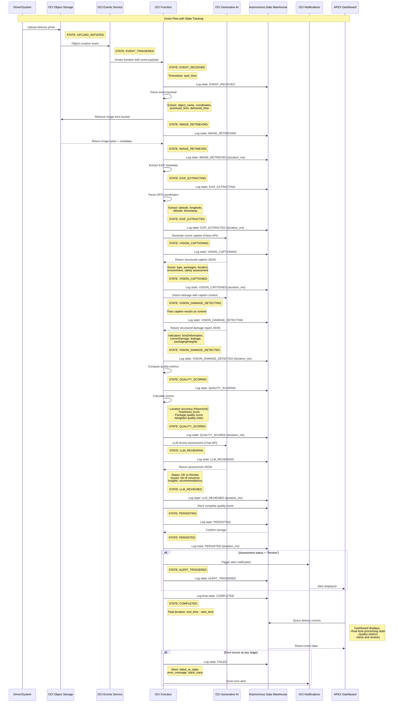

# Event Flow Sequence Diagram

This document describes the complete event flow for the OCI Delivery Intelligence system, including all inputs, outputs, processing stages, and event states for debugging, tracing, and dashboard rollup in APEX/ADW.

---

## System Overview

The Delivery Intelligence system processes delivery photos uploaded to Object Storage, performs AI-powered quality assessment, and stores results for dashboard consumption.

---

## Event Flow Sequence Diagram



---

## Input Data Structure

### Event Payload (from OCI Events)
```json
{
  "eventTime": "2024-11-14T09:30:15.000Z",
  "data": {
    "resourceName": "deliveries/2024/11/14/delivery_12345.jpg",
    "bucketName": "delivery-photos",
    "namespace": "your-namespace"
  },
  "additionalDetails": {
    "expectedLatitude": 37.7749,
    "expectedLongitude": -122.4194,
    "promisedTime": "2024-11-14T09:00:00.000Z",
    "deliveryId": "DEL-12345",
    "driverId": "DRV-789",
    "customerId": "CUST-456"
  }
}
```

### Image Data
- **Format**: JPEG, PNG
- **Size**: Typically 1-5 MB
- **Source**: Object Storage bucket
- **Contains**: Delivery photo with optional EXIF metadata (GPS, timestamp, camera info)

---

## Output Data Structure

### Complete Workflow Output
```json
{
  "delivery_id": "DEL-12345",
  "object_name": "deliveries/2024/11/14/delivery_12345.jpg",
  "processed_at": "2024-11-14T09:30:45.000Z",
  "processing_duration_ms": 3250,
  
  "metadata": {
    "content_type": "image/jpeg",
    "size": 2457600,
    "retrieved_at": "2024-11-14T09:30:16.000Z",
    "source": "oci"
  },
  
  "exif": {
    "GPSInfo": {
      "latitude": 37.7751,
      "longitude": -122.4196,
      "altitude": 15.5
    },
    "timestamp": "2024-11-14 09:28:43"
  },
  
  "caption_json": {
    "sceneType": "delivery",
    "packageVisible": true,
    "packageDescription": "cardboard box with shipping label at doorstep",
    "location": {
      "type": "doorstep",
      "description": "residential entrance with welcome mat"
    },
    "environment": {
      "weather": "clear",
      "timeOfDay": "morning",
      "conditions": "bright sunlight, dry conditions"
    },
    "safetyAssessment": {
      "protected": true,
      "visible": true,
      "secure": true,
      "notes": "Package placed under covered porch, protected from elements"
    },
    "overallDescription": "Package delivered to residential doorstep in clear morning weather. Box is visible and secure under covered porch area."
  },
  
  "caption_summary": "Package successfully delivered to residential doorstep. Cardboard box with shipping label is clearly visible under covered porch, protected from weather and secure from public view.",
  
  "damage_report": {
    "overall": {
      "severity": "none",
      "score": 0.05,
      "rationale": "No visible damage to package. Box appears intact with no deformation, tears, or moisture damage."
    },
    "indicators": {
      "boxDeformation": {
        "present": false,
        "severity": "none",
        "evidence": "Box structure appears normal with no crushed corners or bent edges"
      },
      "cornerDamage": {
        "present": false,
        "severity": "none",
        "evidence": "All corners intact with no visible damage"
      },
      "leakage": {
        "present": false,
        "severity": "none",
        "evidence": "No moisture stains or wet spots visible"
      },
      "packagingIntegrity": {
        "present": false,
        "severity": "none",
        "evidence": "Packaging intact with no tears, holes, or tape failures"
      }
    },
    "packageVisible": true,
    "uncertainties": "None"
  },
  
  "quality_metrics": {
    "location_accuracy": 0.975,
    "timeliness": 0.65,
    "package_quality": 0.95,
    "quality_index": 0.858
  },
  
  "assessment": {
    "status": "OK",
    "issues": [],
    "insights": "Delivery completed successfully with high quality. Package in excellent condition, properly placed at secure location with minimal delay."
  },
  
  "state_history": [
    {
      "state": "EVENT_RECEIVED",
      "timestamp": "2024-11-14T09:30:15.150Z",
      "duration_ms": 0
    },
    {
      "state": "IMAGE_RETRIEVED",
      "timestamp": "2024-11-14T09:30:15.850Z",
      "duration_ms": 700
    },
    {
      "state": "EXIF_EXTRACTED",
      "timestamp": "2024-11-14T09:30:16.100Z",
      "duration_ms": 250
    },
    {
      "state": "VISION_CAPTIONED",
      "timestamp": "2024-11-14T09:30:17.200Z",
      "duration_ms": 1100
    },
    {
      "state": "VISION_DAMAGE_DETECTED",
      "timestamp": "2024-11-14T09:30:18.150Z",
      "duration_ms": 950
    },
    {
      "state": "QUALITY_SCORED",
      "timestamp": "2024-11-14T09:30:18.180Z",
      "duration_ms": 30
    },
    {
      "state": "LLM_REVIEWED",
      "timestamp": "2024-11-14T09:30:18.400Z",
      "duration_ms": 220
    },
    {
      "state": "PERSISTED",
      "timestamp": "2024-11-14T09:30:18.450Z",
      "duration_ms": 50
    },
    {
      "state": "COMPLETED",
      "timestamp": "2024-11-14T09:30:18.450Z",
      "duration_ms": 0
    }
  ]
}
```

---

## Event States Reference

### State Definitions

| State | Description | Trackable Metrics | APEX Use Case |
|-------|-------------|-------------------|---------------|
| **EVENT_RECEIVED** | Function invoked by OCI Events | Start timestamp | Trace event ingestion |
| **IMAGE_RETRIEVING** | Downloading from Object Storage | Network latency | Monitor storage performance |
| **IMAGE_RETRIEVED** | Image successfully downloaded | Download duration, file size | Debug retrieval failures |
| **EXIF_EXTRACTING** | Processing GPS and metadata | Parse duration | Identify metadata issues |
| **EXIF_EXTRACTED** | GPS coordinates extracted | GPS accuracy, coordinate validity | Location accuracy analysis |
| **VISION_CAPTIONING** | GenAI analyzing scene | API call start time | Monitor AI service latency |
| **VISION_CAPTIONED** | Scene analysis complete | API duration, token usage | Caption quality metrics |
| **VISION_DAMAGE_DETECTING** | GenAI assessing damage | API call start time | Damage detection performance |
| **VISION_DAMAGE_DETECTED** | Damage assessment complete | API duration, severity distribution | Damage analytics rollup |
| **QUALITY_SCORING** | Computing quality metrics | Calculation start time | Performance monitoring |
| **QUALITY_SCORED** | Metrics calculated | Score distribution | Quality trend analysis |
| **LLM_REVIEWING** | AI generating assessment | Review start time | LLM performance tracking |
| **LLM_REVIEWED** | Assessment complete | Review duration, decision type | Assessment analytics |
| **PERSISTING** | Saving to ADW | Database operation start | Monitor DB performance |
| **PERSISTED** | Data saved successfully | Write duration, row count | Data integrity checks |
| **COMPLETED** | Processing finished | Total duration | End-to-end performance |
| **ALERT_TRIGGERED** | Notification sent | Alert type, recipient count | Alert management dashboard |
| **FAILED** | Error occurred | Error type, failed stage | Error analysis and debugging |

### State Transitions

```
EVENT_RECEIVED
    ↓
IMAGE_RETRIEVING
    ↓
IMAGE_RETRIEVED
    ↓
EXIF_EXTRACTING
    ↓
EXIF_EXTRACTED
    ↓
VISION_CAPTIONING
    ↓
VISION_CAPTIONED
    ↓
VISION_DAMAGE_DETECTING
    ↓
VISION_DAMAGE_DETECTED
    ↓
QUALITY_SCORING
    ↓
QUALITY_SCORED
    ↓
LLM_REVIEWING
    ↓
LLM_REVIEWED
    ↓
PERSISTING
    ↓
PERSISTED
    ↓
[ALERT_TRIGGERED] (conditional)
    ↓
COMPLETED

(Any state can transition to FAILED on error)
```

---

## ADW Schema for State Tracking

### Table: `DELIVERY_EVENTS`

Stores the complete delivery processing record.

```sql
CREATE TABLE delivery_events (
    event_id VARCHAR2(50) PRIMARY KEY,
    delivery_id VARCHAR2(50) NOT NULL,
    object_name VARCHAR2(500) NOT NULL,
    processed_at TIMESTAMP NOT NULL,
    processing_duration_ms NUMBER,
    current_state VARCHAR2(50) NOT NULL,
    
    -- Input data
    expected_latitude NUMBER(10,7),
    expected_longitude NUMBER(10,7),
    promised_time TIMESTAMP,
    delivered_time TIMESTAMP,
    
    -- Outputs
    caption_json CLOB,
    damage_report CLOB,
    quality_index NUMBER(5,3),
    location_accuracy NUMBER(5,3),
    timeliness NUMBER(5,3),
    package_quality NUMBER(5,3),
    assessment_status VARCHAR2(20),
    assessment_json CLOB,
    
    -- Metadata
    driver_id VARCHAR2(50),
    customer_id VARCHAR2(50),
    created_at TIMESTAMP DEFAULT CURRENT_TIMESTAMP,
    updated_at TIMESTAMP DEFAULT CURRENT_TIMESTAMP,
    
    INDEX idx_delivery_id (delivery_id),
    INDEX idx_processed_at (processed_at),
    INDEX idx_current_state (current_state),
    INDEX idx_assessment_status (assessment_status)
);
```

### Table: `DELIVERY_STATE_HISTORY`

Stores granular state transitions for debugging and performance analysis.

```sql
CREATE TABLE delivery_state_history (
    id NUMBER GENERATED ALWAYS AS IDENTITY PRIMARY KEY,
    event_id VARCHAR2(50) NOT NULL,
    delivery_id VARCHAR2(50) NOT NULL,
    state VARCHAR2(50) NOT NULL,
    timestamp TIMESTAMP NOT NULL,
    duration_ms NUMBER,
    metadata CLOB,
    
    FOREIGN KEY (event_id) REFERENCES delivery_events(event_id),
    INDEX idx_event_id (event_id),
    INDEX idx_state (state),
    INDEX idx_timestamp (timestamp)
);
```

### Table: `DELIVERY_ERRORS`

Stores error details for failed deliveries.

```sql
CREATE TABLE delivery_errors (
    error_id NUMBER GENERATED ALWAYS AS IDENTITY PRIMARY KEY,
    event_id VARCHAR2(50) NOT NULL,
    delivery_id VARCHAR2(50) NOT NULL,
    failed_at_state VARCHAR2(50) NOT NULL,
    error_message CLOB,
    stack_trace CLOB,
    occurred_at TIMESTAMP DEFAULT CURRENT_TIMESTAMP,
    resolved CHAR(1) DEFAULT 'N',
    
    FOREIGN KEY (event_id) REFERENCES delivery_events(event_id),
    INDEX idx_event_id (event_id),
    INDEX idx_failed_at_state (failed_at_state),
    INDEX idx_occurred_at (occurred_at),
    INDEX idx_resolved (resolved)
);
```

---

## APEX Dashboard Queries

### Real-Time Processing Monitor

```sql
SELECT 
    event_id,
    delivery_id,
    object_name,
    current_state,
    processed_at,
    processing_duration_ms,
    CASE 
        WHEN current_state = 'COMPLETED' THEN 'Success'
        WHEN current_state = 'FAILED' THEN 'Failed'
        ELSE 'In Progress'
    END as status
FROM delivery_events
WHERE processed_at >= SYSDATE - INTERVAL '1' HOUR
ORDER BY processed_at DESC;
```

### State Duration Analysis

```sql
SELECT 
    state,
    COUNT(*) as event_count,
    ROUND(AVG(duration_ms), 2) as avg_duration_ms,
    ROUND(MIN(duration_ms), 2) as min_duration_ms,
    ROUND(MAX(duration_ms), 2) as max_duration_ms,
    ROUND(STDDEV(duration_ms), 2) as stddev_duration_ms
FROM delivery_state_history
WHERE timestamp >= SYSDATE - INTERVAL '24' HOUR
GROUP BY state
ORDER BY avg_duration_ms DESC;
```

### Quality Metrics Rollup

```sql
SELECT 
    TO_CHAR(processed_at, 'YYYY-MM-DD HH24') as hour_bucket,
    COUNT(*) as total_deliveries,
    ROUND(AVG(quality_index), 3) as avg_quality_index,
    ROUND(AVG(location_accuracy), 3) as avg_location_accuracy,
    ROUND(AVG(timeliness), 3) as avg_timeliness,
    ROUND(AVG(package_quality), 3) as avg_package_quality,
    SUM(CASE WHEN assessment_status = 'Review' THEN 1 ELSE 0 END) as review_count
FROM delivery_events
WHERE processed_at >= SYSDATE - INTERVAL '7' DAY
GROUP BY TO_CHAR(processed_at, 'YYYY-MM-DD HH24')
ORDER BY hour_bucket DESC;
```

### Error Analysis Dashboard

```sql
SELECT 
    e.failed_at_state,
    COUNT(*) as error_count,
    ROUND(COUNT(*) * 100.0 / SUM(COUNT(*)) OVER (), 2) as error_percentage,
    MAX(e.occurred_at) as last_occurrence
FROM delivery_errors e
WHERE e.occurred_at >= SYSDATE - INTERVAL '24' HOUR
    AND e.resolved = 'N'
GROUP BY e.failed_at_state
ORDER BY error_count DESC;
```

### Alert Management

```sql
SELECT 
    de.event_id,
    de.delivery_id,
    de.assessment_status,
    JSON_VALUE(de.assessment_json, '$.insights') as insights,
    JSON_QUERY(de.assessment_json, '$.issues') as issues,
    dsh.timestamp as alert_triggered_at
FROM delivery_events de
JOIN delivery_state_history dsh 
    ON de.event_id = dsh.event_id 
    AND dsh.state = 'ALERT_TRIGGERED'
WHERE de.assessment_status = 'Review'
    AND de.processed_at >= SYSDATE - INTERVAL '24' HOUR
ORDER BY dsh.timestamp DESC;
```

### Delivery Trace (Debug View)

```sql
SELECT 
    dsh.state,
    dsh.timestamp,
    dsh.duration_ms,
    dsh.metadata
FROM delivery_state_history dsh
WHERE dsh.delivery_id = :P1_DELIVERY_ID
ORDER BY dsh.timestamp ASC;
```

---

## Error Handling

### Error State Data Structure

```json
{
  "event_id": "EVT-12345",
  "delivery_id": "DEL-12345",
  "current_state": "FAILED",
  "error_details": {
    "failed_at_state": "VISION_CAPTIONING",
    "error_message": "GenAI API timeout: Connection timeout after 30s",
    "error_code": "GENAI_TIMEOUT",
    "stack_trace": "...",
    "occurred_at": "2024-11-14T09:30:45.000Z",
    "retry_count": 2,
    "is_retryable": true
  },
  "state_history": [
    {
      "state": "EVENT_RECEIVED",
      "timestamp": "2024-11-14T09:30:15.150Z",
      "duration_ms": 0
    },
    {
      "state": "IMAGE_RETRIEVED",
      "timestamp": "2024-11-14T09:30:15.850Z",
      "duration_ms": 700
    },
    {
      "state": "EXIF_EXTRACTED",
      "timestamp": "2024-11-14T09:30:16.100Z",
      "duration_ms": 250
    },
    {
      "state": "FAILED",
      "timestamp": "2024-11-14T09:30:45.150Z",
      "duration_ms": 30000
    }
  ]
}
```

### Common Error States

| Failed At State | Common Causes | Mitigation |
|-----------------|---------------|------------|
| **IMAGE_RETRIEVING** | Network issues, bucket permissions, object not found | Retry logic, validate bucket access |
| **EXIF_EXTRACTING** | Corrupted image, missing metadata | Graceful fallback, default coordinates |
| **VISION_CAPTIONING** | GenAI API timeout, service unavailable, quota exceeded | Retry with exponential backoff, circuit breaker |
| **VISION_DAMAGE_DETECTING** | GenAI API errors, malformed response | Parse error handling, fallback assessment |
| **QUALITY_SCORING** | Invalid GPS coordinates, calculation errors | Validation checks, default scores |
| **LLM_REVIEWING** | GenAI chat API errors, JSON parse failures | Retry logic, default assessment |
| **PERSISTING** | Database connection errors, constraint violations | Transaction rollback, dead letter queue |

---

## Performance Benchmarks

### Target Durations (milliseconds)

| Stage | Target | Acceptable | Alert Threshold |
|-------|--------|------------|-----------------|
| IMAGE_RETRIEVING | 500 | 1000 | 2000 |
| EXIF_EXTRACTING | 100 | 200 | 500 |
| VISION_CAPTIONING | 800 | 1500 | 3000 |
| VISION_DAMAGE_DETECTING | 800 | 1500 | 3000 |
| QUALITY_SCORING | 50 | 100 | 200 |
| LLM_REVIEWING | 300 | 600 | 1500 |
| PERSISTING | 100 | 200 | 500 |
| **Total Pipeline** | **2650** | **5100** | **10700** |

---

## Integration with Existing Dashboards

The state tracking system integrates with the existing dashboard components:

### Customer Service Dashboard
- **At-Risk Queue**: Filter deliveries with `assessment_status = 'Review'`
- **Recent Activity**: Show state progression in real-time
- **Impact Metrics**: Aggregate quality scores by time period

### Operations Manager Dashboard
- **Critical Alerts**: Show deliveries in `ALERT_TRIGGERED` state
- **Action Queue**: Prioritize failed deliveries for manual review
- **Daily Summary**: Rollup quality metrics and state statistics

### Driver Dashboard
- **Performance Metrics**: Show per-driver quality scores
- **Today's Goals**: Track completion states
- **Achievements**: Recognize high-quality deliveries (quality_index > 0.9)

---

## Next Steps for Implementation

1. **Update Function Code**: Add state logging to `handlers.py`
2. **Create ADW Tables**: Execute schema DDL in Autonomous Data Warehouse
3. **Build APEX Pages**: Create dashboard pages with provided queries
4. **Configure Alerts**: Set up notifications for state thresholds
5. **Add Monitoring**: Create CloudWatch/OCI Monitoring dashboards
6. **Test End-to-End**: Validate state tracking with sample deliveries

---

## References

- [System Architecture](docs/system-architecture.md)
- [GenAI Implementation](docs/genai-vision-implementation.md)
- [Dashboard Specification](docs/dashboard-specification.md)
- [API Response Format](docs/api-response-format.md)
